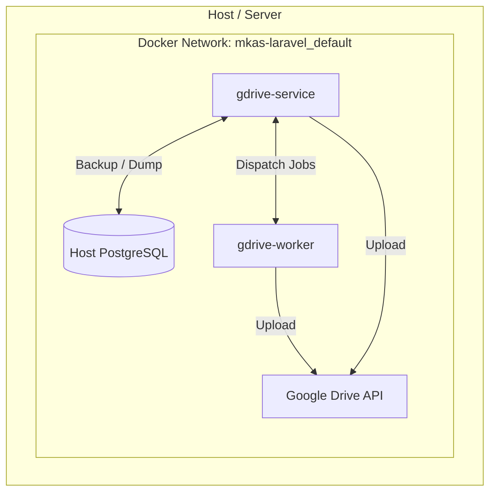

# Laravel Google Drive Backup & Upload Service

Proyek ini adalah layanan mikro (microservice) berbasis **Laravel 13** dan **PHP 8.4** yang dirancang khusus untuk menangani proses backup database PostgreSQL secara berkala ke Google Drive, serta menyediakan API untuk mengunggah dan mengompresi berkas/gambar ke Google Drive.

Layanan ini berjalan sebagai **API-only service** (tanpa antarmuka HTML/UI) dan diintegrasikan dengan aplikasi utama lainnya melalui request HTTP JSON atau CLI Command.

---

## 1. Arsitektur Sistem & Komponen Kontainer

Sistem didefinisikan menggunakan **Docker Compose** dan terbagi menjadi beberapa komponen utama:



### Penjelasan Layanan Kontainer:
1. **`gdrive-service`** (Web Server API):
   - Menjalankan Laravel CLI Server (`php artisan serve`) di port `8000` (diekspos ke port host `8095`).
   - Melayani HTTP Request (API) untuk status check, upload file, dan trigger database backup secara manual.
2. **`gdrive-worker`** (Queue Handler):
   - Menjalankan Laravel Queue Worker (`php artisan queue:work`) di latar belakang.
   - Menangani tugas asinkron seperti kompresi gambar dan proses upload berkas berukuran besar agar tidak menghalangi performa HTTP request utama.
3. **`PostgreSQL`** (Host):
   - Instance PostgreSQL yang berjalan pada host WSL dan menjadi target utama proses backup database.

---

## 2. Kelas & Komponen Kode Utama (PHP)

Layanan ini menggunakan pola desain modular dengan membagi tugas ke dalam beberapa kelas khusus:

### A. Layanan Inti Google Drive
* **Berkas**: [GoogleDriveService.php](app/Services/GoogleDriveService.php)
* **Fungsi Utama**:
  - Menginisialisasi Client Google API (`Google\Client`) berdasarkan mode otentikasi yang dipilih (OAuth 2.0 / Service Account).
  - Menyelesaikan struktur folder Google Drive secara rekursif (`resolveFolderIdForPath`).
  - Melakukan kompresi gambar secara natif (`compressImage`) menggunakan ekstensi PHP GD untuk tipe JPEG, PNG, dan WebP sebelum dikirim ke Google Drive.
  - Mendukung upload sinkron (`uploadSync`) and asinkron (`uploadImage`).
  - Mengambil/mengunduh data berkas untuk preview (`getImage`).
  - Menampilkan daftar berkas di folder tertentu (`listFiles`).

### B. Perintah CLI (Artisan Command)
* **Berkas**: [BackupDatabaseCommand.php](app/Console/Commands/BackupDatabaseCommand.php)
* **Perintah**: `php artisan db:backup {--async}`
* **Fungsi Utama**:
  - Melakukan backup database PostgreSQL menggunakan tool `pg_dump` yang dipasang di Alpine.
  - Hasil dump SQL langsung dikompresi di memori/aliran pipa (`gzip`) menjadi file `.sql.gz` untuk meminimalkan konsumsi ruang penyimpanan disk lokal.
  - Menggunakan bendera `bash -o pipefail` untuk memastikan jika proses `pg_dump` gagal (misalnya karena masalah hak akses database), proses akan dihentikan seketika dan tidak mengunggah file kosong ke Google Drive.
  - Berkas lokal sementara akan langsung dihapus setelah proses upload berhasil diselesaikan.
  - Mendukung opsi `--async` untuk mendelegasikan pengunggahan file dump ke Queue Worker.

### C. Antrean Job (Queue Job)
* **Berkas**: [UploadToGoogleDriveJob.php](app/Jobs/UploadToGoogleDriveJob.php)
* **Fungsi Utama**:
  - Dijalankan oleh queue worker (`gdrive-worker`).
  - Membaca berkas temporary yang disimpan secara lokal di dalam folder `storage/app/gdrive_temp`.
  - Melakukan kompresi (jika diaktifkan) dan mengunggah berkas tersebut ke Google Drive.
  - Menghapus berkas sementara dari local storage setelah proses selesai.

### D. HTTP Controller
* **Berkas**: [GoogleDriveController.php](app/Http/Controllers/GoogleDriveController.php)
* **Fungsi Utama**:
  - `index()`: Mengembalikan status kesehatan (Health Check) layanan serta konektivitas Google Drive dalam format JSON.
  - `upload()`: Memvalidasi berkas masukan (maksimal 10MB) dan mengunggahnya ke Google Drive dengan parameter asinkron/kompresi. Mengembalikan respon JSON.
  - `preview()`: Bertindak sebagai proxy/streamer berkas privat Google Drive agar dapat langsung dirender di browser klien.
  - `backup()`: Menyediakan endpoint API untuk memicu perintah `db:backup` melalui request HTTP POST.

---

## 3. Jalur API & Web (Routing)

Semua rute didefinisikan secara efisien di dalam [web.php](routes/web.php) dan mengembalikan respons **JSON/Binary Stream** (tanpa UI HTML):

| Method | Endpoint | Fungsi | Parameter Request |
| :--- | :--- | :--- | :--- |
| **GET** | `/` | Status/Health Check & Konektivitas Google Drive. | - |
| **POST** | `/api/upload` | Mengunggah berkas/gambar dari container lain. | `file` (binary, required), `target_path` (opsional), `async` (boolean), `compress` (boolean), `quality` (int) |
| **GET** | `/api/preview` | Preview/stream berkas secara langsung di browser. | `path` (string, required) |
| **POST** | `/api/backup` | Trigger database backup secara remote lewat API. | `async` (boolean, opsional) |

---

## 4. Mekanisme Otentikasi Google API

Layanan ini mendukung **dua mode otentikasi utama** yang diatur melalui variabel `.env`:

1. **OAuth 2.0 (Refresh Token) - *Sangat Direkomendasikan***:
   - Menggunakan Client ID, Client Secret, dan Refresh Token yang didapatkan dari Google Cloud Console.
   - Mode ini otomatis memperbarui Access Token yang kedaluwarsa secara berkala di latar belakang.
   - Diaktifkan dengan mengatur `GOOGLE_DRIVE_CREDENTIALS_MODE=refresh_token`.
2. **Service Account JSON**:
   - Menggunakan file kunci `.json` milik akun layanan Google Cloud Platform.
   - Diaktifkan dengan mengatur `GOOGLE_DRIVE_CREDENTIALS_MODE=file`.

---

## 5. Konfigurasi Environment (`.env`)

Konfigurasi di bawah ini digunakan untuk mengatur perilaku proyek:

```env
# Koneksi Database Target Backup (PostgreSQL Host WSL)
DB_CONNECTION=pgsql
DB_HOST=host.docker.internal
DB_PORT=5432
DB_DATABASE=gdrive_laravel
DB_USERNAME=postgres
DB_PASSWORD=password

# Pengaturan Otentikasi Google Drive
GOOGLE_DRIVE_CREDENTIALS_MODE=refresh_token
GOOGLE_DRIVE_CLIENT_ID=your-client-id.apps.googleusercontent.com
GOOGLE_DRIVE_CLIENT_SECRET=your-client-secret
GOOGLE_DRIVE_REFRESH_TOKEN=your-long-lived-refresh-token

# Target Folder di Google Drive
GOOGLE_DRIVE_FOLDER_PATH="MKAS LARAVEL STORAGE"

# Konfigurasi Upload & Kompresi Default
GDRIVE_UPLOAD_MODE=sync                  # Opsi: sync / async (untuk mematikan/mengaktifkan queue default)
GDRIVE_COMPRESS_ENABLED=true             # Aktifkan kompresi gambar default
GDRIVE_COMPRESS_QUALITY=75               # Kualitas kompresi gambar (1-100)
```

---

## 6. Docker & Otomatisasi CI/CD (GitHub Actions)

### A. Dockerfile 2-Stage
Untuk mengurangi ukuran image di server produksi, [Dockerfile](Dockerfile) dipisahkan menjadi 2 tahap:
1. **Stage 1 (Composer Builder)**: Mengunduh dependensi PHP untuk kebutuhan produksi saja.
2. **Stage 2 (Runtime)**: Image akhir yang bersih berbasis Alpine Linux dengan PHP 8.4 CLI, menyalin file kode inti dan folder `vendor` dari Stage 1. Dilengkapi dengan `postgresql-client` untuk mendukung perintah `pg_dump`.

### B. CI/CD GitHub Actions
Berkas [deploy.yml](.github/workflows/deploy.yml) mendefinisikan alur pipa otomatisasi untuk pembangunan image Docker dan deployment otomatis ke server.
# gdrive-laravel-projects
