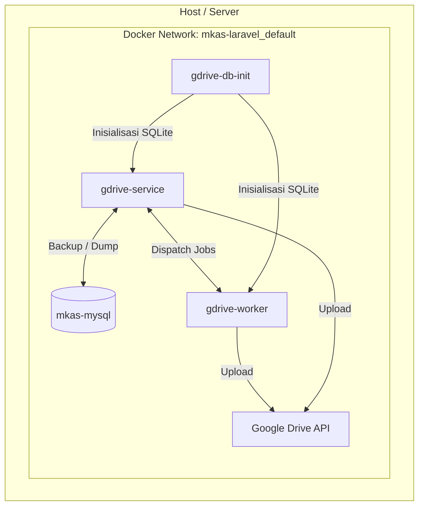

# Laravel Google Drive Backup & Upload Service

Proyek ini adalah layanan mikro (microservice) berbasis **Laravel 13** dan **PHP 8.4** yang dirancang khusus untuk menangani proses backup database MySQL secara berkala ke Google Drive, serta menyediakan API untuk mengunggah dan mengompresi berkas/gambar ke Google Drive.

Layanan ini berjalan sebagai **API-only service** (tanpa antarmuka HTML/UI) dan diintegrasikan dengan aplikasi utama lainnya melalui request HTTP JSON atau CLI Command.

---

## 1. Arsitektur Sistem & Komponen Kontainer

Sistem didefinisikan menggunakan **Docker Compose** dan terbagi menjadi beberapa komponen utama:



### Penjelasan Layanan Kontainer:
1. **`gdrive-service`** (Web Server API):
   - Menjalankan Laravel CLI Server (`php artisan serve`) di port `8000` (diekspos ke port host `8095`).
   - Melayani HTTP Request (API) untuk status check, upload file, dan trigger database backup secara manual.
2. **`gdrive-worker`** (Queue Handler):
   - Menjalankan Laravel Queue Worker (`php artisan queue:work`) di latar belakang.
   - Menangani tugas asinkron seperti kompresi gambar dan proses upload berkas berukuran besar agar tidak menghalangi performa HTTP request utama.
3. **`gdrive-db-init`** (Helper):
   - Kontainer pembantu berbasis Alpine Linux untuk membuat file basis data lokal SQLite (`database.sqlite`) beserta hak akses yang tepat (`chmod 777`) saat startup kontainer pertama kali. SQLite digunakan oleh Laravel untuk menyimpan sesi, cache, dan antrean job (queue).
4. **`mkas-mysql`** (Eksternal):
   - Kontainer MySQL eksternal yang terhubung pada jaringan Docker `mkas-laravel_default` dan menjadi target utama proses backup database.

---

## 2. Kelas & Komponen Kode Utama (PHP)

Layanan ini menggunakan pola desain modular dengan membagi tugas ke dalam beberapa kelas khusus:

### A. Layanan Inti Google Drive
* **Berkas**: [GoogleDriveService.php](file:////wsl.localhost/Ubuntu/home/rijal/projects/laravel/gdrive-laravel/app/Services/GoogleDriveService.php)
* **Fungsi Utama**:
  - Menginisialisasi Client Google API (`Google\Client`) berdasarkan mode otentikasi yang dipilih (OAuth 2.0 / Service Account).
  - Menyelesaikan struktur folder Google Drive secara rekursif (`resolveFolderIdForPath`). Contoh: Jika diberikan path `MKAS LARAVEL STORAGE/TRANSACTIONS/bukti.jpg`, kelas ini akan mendeteksi atau membuat folder `MKAS LARAVEL STORAGE`, kemudian membuat subfolder `TRANSACTIONS`, lalu mengembalikan ID folder terakhir tersebut.
  - Melakukan kompresi gambar secara natif (`compressImage`) menggunakan ekstensi PHP GD untuk tipe JPEG, PNG, dan WebP sebelum dikirim ke Google Drive.
  - Mendukung upload sinkron (`uploadSync`) dan asinkron (`uploadImage`).
  - Mengambil/mengunduh data berkas untuk preview (`getImage`).
  - Menampilkan daftar berkas di folder tertentu (`listFiles`).

### B. Perintah CLI (Artisan Command)
* **Berkas**: [BackupDatabaseCommand.php](file:////wsl.localhost/Ubuntu/home/rijal/projects/laravel/gdrive-laravel/app/Console/Commands/BackupDatabaseCommand.php)
* **Perintah**: `php artisan db:backup {--async}`
* **Fungsi Utama**:
  - Melakukan backup database MySQL menggunakan tool `mysqldump` yang dipasang di Alpine.
  - Hasil dump SQL langsung dikompresi di memori/aliran pipa (`gzip`) menjadi file `.sql.gz` untuk meminimalkan konsumsi ruang penyimpanan disk lokal.
  - Menggunakan bendera `bash -o pipefail` untuk memastikan jika proses `mysqldump` gagal (misalnya karena masalah hak akses database), proses akan dihentikan seketika dan tidak mengunggah file kosong ke Google Drive.
  - Berkas lokal sementara akan langsung dihapus setelah proses upload berhasil diselesaikan.
  - Mendukung opsi `--async` untuk mendelegasikan pengunggahan file dump ke Queue Worker.

### C. Antrean Job (Queue Job)
* **Berkas**: [UploadToGoogleDriveJob.php](file:////wsl.localhost/Ubuntu/home/rijal/projects/laravel/gdrive-laravel/app/Jobs/UploadToGoogleDriveJob.php)
* **Fungsi Utama**:
  - Dijalankan oleh queue worker (`gdrive-worker`).
  - Membaca berkas temporary yang disimpan secara lokal di dalam folder `storage/app/gdrive_temp`.
  - Melakukan kompresi (jika diaktifkan) dan mengunggah berkas tersebut ke Google Drive.
  - Menghapus berkas sementara dari local storage setelah proses selesai.

### D. HTTP Controller
* **Berkas**: [GoogleDriveController.php](file:////wsl.localhost/Ubuntu/home/rijal/projects/laravel/gdrive-laravel/app/Http/Controllers/GoogleDriveController.php)
* **Fungsi Utama**:
  - `index()`: Mengembalikan status kesehatan (Health Check) layanan serta konektivitas Google Drive dalam format JSON.
  - `upload()`: Memvalidasi berkas masukan (maksimal 10MB) dan mengunggahnya ke Google Drive dengan parameter asinkron/kompresi. Mengembalikan respon JSON.
  - `preview()`: Bertindak sebagai proxy/streamer berkas privat Google Drive agar dapat langsung dirender di browser klien (`inline disposition`) dengan pengaturan cache header demi efisiensi.
  - `backup()`: Menyediakan endpoint API untuk memicu perintah `db:backup` melalui request HTTP POST.

---

## 3. Jalur API & Web (Routing)

Semua rute didefinisikan secara efisien di dalam [web.php](file:////wsl.localhost/Ubuntu/home/rijal/projects/laravel/gdrive-laravel/routes/web.php) dan mengembalikan respons **JSON/Binary Stream** (tanpa UI HTML):

| Method | Endpoint | Fungsi | Parameter Request |
| :--- | :--- | :--- | :--- |
| **GET** | `/` | Status/Health Check & Konektivitas Google Drive. | - |
| **POST** | `/api/upload` | Mengunggah berkas/gambar dari container lain. | `file` (binary, required), `target_path` (opsional), `async` (boolean), `compress` (boolean), `quality` (int) |
| **GET** | `/api/preview` | Preview/stream berkas secara langsung di browser. | `path` (string, required) |
| **POST** | `/api/backup` | Trigger database backup secara remote lewat API. | `async` (boolean, opsional) |

### Contoh Pemanggilan API dari Container Lain:

#### 1. Trigger Backup Database:
```bash
curl -X POST http://gdrive-service:8000/api/backup \
     -H "Accept: application/json" \
     -d "async=true"
```

#### 2. Upload Berkas dengan Kompresi Gambar:
```bash
curl -X POST http://gdrive-service:8000/api/upload \
     -H "Accept: application/json" \
     -F "file=@/path/to/local/file.jpg" \
     -F "target_path=MKAS LARAVEL STORAGE/TRANSACTIONS/bukti.jpg" \
     -F "compress=true" \
     -F "quality=80"
```

---

## 4. Mekanisme Otentikasi Google API

Layanan ini mendukung **dua mode otentikasi utama** yang diatur melalui variabel `.env`:

1. **OAuth 2.0 (Refresh Token) - *Sangat Direkomendasikan***:
   - Menggunakan Client ID, Client Secret, dan Refresh Token yang didapatkan dari Google Cloud Console.
   - Mode ini otomatis memperbarui Access Token yang kedaluwarsa secara berkala di latar belakang, tanpa memerlukan interaksi manual pengguna.
   - Diaktifkan dengan mengatur `GOOGLE_DRIVE_CREDENTIALS_MODE=refresh_token`.
2. **Service Account JSON**:
   - Menggunakan file kunci `.json` (atau string JSON langsung di variabel lingkungan) milik akun layanan Google Cloud Platform.
   - File JSON diletakkan di dalam folder `storage/app/` dan ditautkan melalui path.
   - Diaktifkan dengan mengatur `GOOGLE_DRIVE_CREDENTIALS_MODE=file`.

---

## 5. Konfigurasi Environment (`.env`)

Konfigurasi di bawah ini digunakan untuk mengatur perilaku proyek:

```env
# Koneksi Database Target Backup
DB_CONNECTION=mysql
DB_HOST=mkas-mysql
DB_PORT=3306
DB_DATABASE=mkas_db
DB_USERNAME=root
DB_PASSWORD=root

# Pengaturan Otentikasi Google Drive
GOOGLE_DRIVE_CREDENTIALS_MODE=refresh_token
GOOGLE_DRIVE_CLIENT_ID=your-client-id.apps.googleusercontent.com
GOOGLE_DRIVE_CLIENT_SECRET=your-client-secret
GOOGLE_DRIVE_REFRESH_TOKEN=your-long-lived-refresh-token

# Target Folder di Google Drive
GOOGLE_DRIVE_FOLDER_PATH="MKAS LARAVEL STORAGE"

# Konfigurasi Upload & Kompresi Default
GDRIVE_UPLOAD_MODE=sync                  # Opsi: sync / async (untuk mematikan/mengaktifkan queue default)
GDRIVE_COMPRESS_ENABLED=true             # Aktifkan kompresi gambar default
GDRIVE_COMPRESS_QUALITY=75               # Kualitas kompresi gambar (1-100)
```

---

## 6. Docker & Otomatisasi CI/CD (GitHub Actions)

### A. Dockerfile 2-Stage
Untuk mengurangi ukuran image di server produksi, [Dockerfile](file:////wsl.localhost/Ubuntu/home/rijal/projects/laravel/gdrive-laravel/Dockerfile) dipisahkan menjadi 2 tahap (tanpa compiler Node.js karena tidak ada UI):
1. **Stage 1 (Composer Builder)**: Mengunduh dependensi PHP untuk kebutuhan produksi saja (`composer install --no-dev --optimize-autoloader`).
2. **Stage 2 (Runtime)**: Image akhir yang bersih berbasis Alpine Linux dengan PHP 8.4 CLI, menyalin file kode inti dan folder `vendor` dari Stage 1. Image akhir ini sangat ringan karena tidak mengandung file NodeJS/NPM, source CSS/JS, dan cache composer.

### B. CI/CD GitHub Actions
Berkas [deploy.yml](file:////wsl.localhost/Ubuntu/home/rijal/projects/laravel/gdrive-laravel/.github/workflows/deploy.yml) mendefinisikan alur pipa otomatisasi:
- Berjalan secara otomatis setiap kali ada perubahan kode yang di-*push* ke cabang `main` atau `master`.
- Menggunakan fitur cache GitHub Actions (`type=gha`) agar pembangunan image Docker berikutnya berjalan sangat cepat.
- Masuk ke Docker Hub dan mengunggah image dengan tag `latest` dan tag unik berdasarkan Git SHA commit.
- Menyediakan opsi deployment otomatis (SSH) untuk langsung memerintahkan server produksi/VPS mengunduh image terbaru dan memperbarui kontainer aplikasi.
# gdrive-laravel-projects
